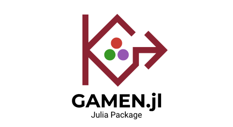

<p align="center">
  &nbsp;&nbsp;&nbsp;&nbsp;&nbsp;&nbsp;&nbsp;&nbsp;
</p>

<h1 align="center">Gamen.jl</h1>

<p align="center">
  <em>Modal logic and game-theoretic reasoning in Julia</em>
</p>

<p align="center">
  <a href="https://bd.openlogicproject.org">
    
  </a>
</p>

---

The name comes from Old English *gamen* (game, sport, joy), the ancestor of the modern word "game."

Gamen.jl is a Julia package for working with [modal logic](https://en.wikipedia.org/wiki/Modal_logic), following the presentation in [**Boxes and Diamonds: An Open Introduction to Modal Logic**](https://bd.openlogicproject.org) by Richard Zach (Open Logic Project). It provides type-safe formula construction, Kripke semantics, model checking, and frame definability analysis.

## Features

- **Formula construction** -- a full type hierarchy for propositional and modal formulas (`Atom`, `Not`, `And`, `Or`, `Implies`, `Iff`, `Box`, `Diamond`)
- **Kripke semantics** -- frames, models, accessibility relations, and the satisfaction relation M, w &#8873; A
- **Model checking** -- determine truth of formulas at worlds, in models, and across classes of models
- **Frame definability** -- test frame properties (reflexive, symmetric, transitive, serial, euclidean) and verify correspondence with modal schemas (K, T, D, B, 4, 5)
- **Entailment** -- check whether premises entail a conclusion across all worlds

## Installation

```julia
using Pkg
Pkg.add("Gamen")
```

## Quick Start

```julia
using Gamen

# Build formulas (Definition 1.2, B&D)
p = Atom(:p)
q = Atom(:q)
schema_k = Implies(Box(Implies(p, q)), Implies(Box(p), Box(q)))  # □(p→q) → (□p→□q)

# Create a Kripke model (Definition 1.6, B&D -- Figure 1.1)
frame = KripkeFrame([:w1, :w2, :w3], [:w1 => :w2, :w1 => :w3])
model = KripkeModel(frame, [:p => [:w1, :w2], :q => [:w2]])

# Model checking (Definition 1.7, B&D)
satisfies(model, :w1, Diamond(q))   # true  -- w2 is accessible and q holds there
satisfies(model, :w1, Box(q))       # false -- w3 is accessible but q fails there
satisfies(model, :w3, Box(Bottom()))  # true  -- vacuously, w3 has no successors
```

## Frame Definability (Chapter 2)

Test structural properties of frames and their correspondence with modal schemas:

```julia
# Build a reflexive, transitive frame (a preorder)
s4_frame = KripkeFrame([:w1, :w2, :w3],
    [:w1 => :w1, :w2 => :w2, :w3 => :w3,
     :w1 => :w2, :w2 => :w3, :w1 => :w3])

is_reflexive(s4_frame)   # true
is_transitive(s4_frame)  # true

# Schema T (□p → p) is valid on reflexive frames (Proposition 2.5, B&D)
is_valid_on_frame(s4_frame, Implies(Box(p), p))  # true

# Schema 4 (□p → □□p) is valid on transitive frames (Proposition 2.11, B&D)
is_valid_on_frame(s4_frame, Implies(Box(p), Box(Box(p))))  # true
```

| Schema | Formula | Frame Property | B&D Reference |
|:-------|:--------|:---------------|:--------------|
| **K** | `□(p→q) → (□p→□q)` | All frames | Proposition 1.19 |
| **T** | `□p → p` | Reflexive | [Proposition 2.5](https://bd.openlogicproject.org) |
| **D** | `□p → ◇p` | Serial | [Proposition 2.7](https://bd.openlogicproject.org) |
| **B** | `p → □◇p` | Symmetric | [Proposition 2.9](https://bd.openlogicproject.org) |
| **4** | `□p → □□p` | Transitive | [Proposition 2.11](https://bd.openlogicproject.org) |
| **5** | `◇p → □◇p` | Euclidean | [Proposition 2.13](https://bd.openlogicproject.org) |

## Textbook

This package implements concepts from:

> Richard Zach, *[Boxes and Diamonds: An Open Introduction to Modal Logic](https://bd.openlogicproject.org)*, Open Logic Project, 2019+.

Coverage so far:

- **Chapter 1: Syntax and Semantics** -- formulas, Kripke models, satisfaction, truth in a model, validity, entailment
- **Chapter 2: Frame Definability** -- frame properties, frame validity, schema-property correspondence
- **Chapters 3+** -- coming soon (proof systems, completeness, applied modal logics)

## Project Structure

```
src/
  Gamen.jl            # Module definition
  formulas.jl          # Formula type hierarchy
  kripke.jl            # Kripke frames and models
  semantics.jl         # Satisfaction, truth, validity, entailment
  frame_properties.jl  # Frame properties and frame validity
test/
  runtests.jl          # Test suite
docs/                  # Documenter.jl documentation
notebooks/
  pluto/               # Interactive Pluto notebooks per chapter
```

## Notebooks

Interactive notebooks are provided for each chapter:

- `notebooks/pluto/ch1_syntax_and_semantics.jl` -- formulas, models, and model checking
- `notebooks/pluto/ch2_frame_definability.jl` -- frame properties and correspondence results

Open them with [Pluto.jl](https://github.com/fonsp/Pluto.jl):

```julia
using Pluto
Pluto.run(notebook="notebooks/pluto/ch1_syntax_and_semantics.jl")
```

## License

MIT
